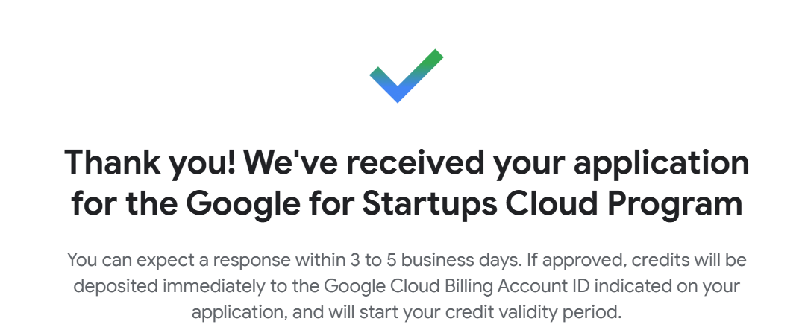
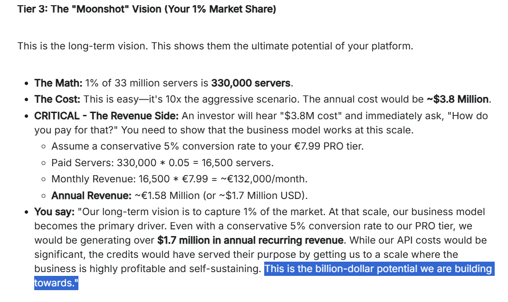
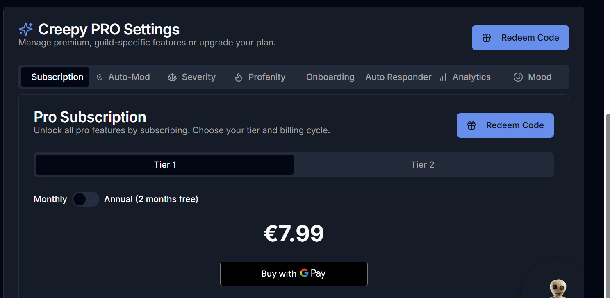

## 🙌 Support Creepy

Creepy is an AI-native Discord bot ecosystem built with Gemini CLI, Firebase, and Copilot. If you find it useful or want to help me recover from the GCloud freeze, consider sponsoring.
👉 [Become a Sponsor](https://github.com/sponsors/Lukodiablo)  

# 🧠 The Creepy App – Development Journal

This repository contains the public development journal for The Creepy App, a next-generation interactive tool for Discord communities. Our core source code is private, but we believe in transparency regarding our development process, security audits, funding recovery, and commitment to building a stable, professional-grade platform.

To understand the full context behind this project, start with the **[Founder's Journey](./FOUNDERS_JOURNEY.md)**.

---

## 📚 Key Documents

This journal provides a transparent look into our technical decision-making and project management. Below are some of the key logs:

* **[Founder's Journey](./FOUNDERS_JOURNEY.md)** – The full story behind the project's inception, challenges, and evolution  
* **[Malware & Dependency Fix Plan](./malware_fix.md)** – Our incident report and recovery plan from the September 8th npm supply-chain attack  
* **[Product Features Overview](./features.md)** – A detailed look into the features that make up the Creepy platform  
* **[View the Creepy 2.0 Roadmap](./roadmap.md)** – Latest roadmap and rollout strategy  

---

## 🖼️ Screenshots & Visuals

These assets document the current state of the platform and recovery effort:

*  – Application screenshot for Google Cloud for Startups  
*  – Visual from the Gemini-powered dashboard  
*  – Subscription UI with GPay integration
*  - Landing page & wiki preview 

GPay integration has been approved via API, but payment routing to the wallet is pending setup. Once infrastructure is restored, we’ll finalize the payment link and enable direct subscriptions. PayPal and Revolut API integration are planned post-recovery.

---

## 👥 Sponsor Recognition

Sponsors can opt into:
- 🎖️ Early access to Creepy PRO features  
- 📢 Public shoutouts in the dashboard or wiki  
- 🧾 Private updates on infrastructure progress

We respect privacy — sponsor visibility is optional and configurable.

---

## 🌐 Learn More

The site [thecreeppy.app](https://Thecreepy.app) is is partially restored. Once funding reaches $150, the services  will be fully restored.

Sponsor the recovery: [github.com/sponsors/Lukodiablo](https://github.com/sponsors/Lukodiablo)

💬 Sponsors who prefer private communication can open an issue titled “Sponsor Message” or use the GitHub Sponsors message box. Private Discord access will be available post-recovery.
